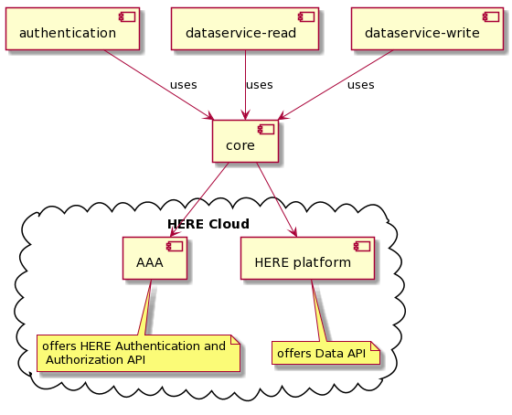

# Overall Architecture of HERE OLP Edge SDK C++

## Outline

This document describes the overall architecture of the HERE OLP Edge SDK C++ (here also referred to as SDK). For an overview of the scope and the features of the SDK, see [README.md](../README.md#why-use).

## Component Overview

The HERE OLP Edge SDK C++ consists of three main independent modules:

* **olp-cpp-sdk-authentication**
* **olp-cpp-sdk-dataservice-read**
* **olp-cpp-sdk-dataservice-write**

Each of these modules has a dependency on the **olp-cpp-sdk-core** module that contains a set of utilities shared among all modules.

In the following sections, you find description of each of these modules.

### Component Detail

The following diagram shows an overview of the SDK components and their relationship with the HERE Cloud.

#### olp-cpp-sdk-core

The core module offers the following platform-independent functionality:

* **cache** - on-disk and in-memory cache
* **client** - generic HTTP client that performs communication with the HERE Open Location Platform (OLP)
* **geo** - geo utilities
* **logging** - logging to file, console or any customer-defined logger
* **math** - geo math utilities
* **network** - wraps network implementation on the supported platforms
* **thread** - utility classes commonly used in concurrent programming
* **utils** - some utilities such as base64 or LRU cache

#### olp-cpp-sdk-authentication

The authentication module wraps the HERE Authentication and Authorization REST API. It's an OAuth 2.0 compliant REST API that lets you obtain short-lived access tokens that are used to authenticate requests to HERE services. Tokens expire after 24 hours.

For more information on how to use this module, see the [read and write examples](../docs).

#### olp-cpp-sdk-dataservice-read

The dataservice-read module wraps a subset of the HERE Open Location Platform Data REST API related to reading data from OLP catalogs. It allows reading of data from the following layer types and with the listed Data APIs:

* Versioned layer. Used Data APIs:
  * [Config API](https://developer.here.com/olp/documentation/data-store/api-reference-config.html)
  * [Metadata API](https://developer.here.com/olp/documentation/data-store/api-reference-metadata.html)
  * [Query API](https://developer.here.com/olp/documentation/data-store/api-reference-query.html)
  * [Blob API](https://developer.here.com/olp/documentation/data-store/api-reference-blob.html)
* Volatile layer. Used Data APIs:
  * [Config API](https://developer.here.com/olp/documentation/data-store/api-reference-config.html)
  * [Metadata API](https://developer.here.com/olp/documentation/data-store/api-reference-metadata.html)
  * [Query API](https://developer.here.com/olp/documentation/data-store/api-reference-query.html)
  * [Volatile API](https://developer.here.com/olp/documentation/data-store/api-reference-volatile-blob.html)
* Index layer (not supported yet). Used Data APIs:
  * [Index API](https://developer.here.com/olp/documentation/data-store/api-reference-index.html)
  * [Blob API](https://developer.here.com/olp/documentation/data-store/api-reference-blob.html)
* Stream layer (not supported yet). Used Data APIs:
  * [Stream API](https://developer.here.com/olp/documentation/data-store/api-reference-stream.html)
  * [Blob API](https://developer.here.com/olp/documentation/data-store/api-reference-blob.html)

For more information on how to use this module, see the [read example](dataservice-read-catalog-example.md).

#### olp-cpp-sdk-dataservice-write

The dataservice-write module wraps a subset of the HERE Open Location Platform Data REST API related to writing data to OLP catalogs. It allows writing of data to the following layer types and with the listed Data APIs:

* Versioned layer. Used Data APIs:
  * [Publish API](https://developer.here.com/olp/documentation/data-store/api-reference-publish.html)
  * [Blob API](https://developer.here.com/olp/documentation/data-store/api-reference-blob.html)
* Volatile layer. Used Data APIs:
  * [Publish API](https://developer.here.com/olp/documentation/data-store/api-reference-publish.html)
  * [Volatile API](https://developer.here.com/olp/documentation/data-store/api-reference-volatile-blob.html)
* Index layer. Used Data APIs:
  * [Index API](https://developer.here.com/olp/documentation/data-store/api-reference-index.html)
  * [Blob API](https://developer.here.com/olp/documentation/data-store/api-reference-blob.html)
* Stream layer. Used Data APIs:
  * [Ingest API](https://developer.here.com/olp/documentation/data-store/api-reference-ingest.html)
  * [Publish API](https://developer.here.com/olp/documentation/data-store/api-reference-publish.html)
  * [Blob API](https://developer.here.com/olp/documentation/data-store/api-reference-blob.html)

For more information on how to use this module, see the [write example](dataservice-write-example.md).

### External Dependencies and Depending Systems

See [README.md](../README.md#dependencies).

## Requirements Overview

The requirements break down into feature and nonfunctional requirements.

### Feature Requirements

#### Authentication

Feature                          |  Status
---------------------------------|--------------
Sign in with client credentials  | Implemented
Sign in with email and password  | Implemented
Sign in with Facebook            | Implemented
Sign in with Google              | Implemented
Sign in with ArcGIS              | Implemented
Sign in with refresh token       | Implemented
Sign out                         | Implemented
Accept terms                     | Implemented

#### Dataservice-Read

Feature                          |  Status
---------------------------------|--------------
Reading from versioned layer     | Implemented
Reading from volatile layer      | Implemented
Reading from stream layer        | Implemented
Reading from indexed layer       | Implemented
API Lookup Service               | Implemented
Get catalog and layer configuration | Implemented
Get partition metadata for all partitions | Implemented
Get partition metadata for a subset of partitions | Planned
OLP Statistics Service  | Planned

#### Dataservice-Write

Feature                          |  Status
---------------------------------|--------------
Writing to versioned layer       | Implemented
Writing to volatile layer        | Implemented
Writing to stream layer          | Implemented
Writing to indexed layer         | Implemented
API Lookup Service               | Implemented

#### Additional Features

Feature                          |  Status
---------------------------------|--------------
LRU caching                      | Implemented
Prefetching data strategies      | Planned
Off-line capabilities            | Planned

### Nonfunctional Requirements

The nonfunctional requirements are being finalized. After that this section is to be updated.

## Security Model

The user of the HERE OLP Edge SDK C++ is responsible to take care of any security and privacy requirements of the target system.
